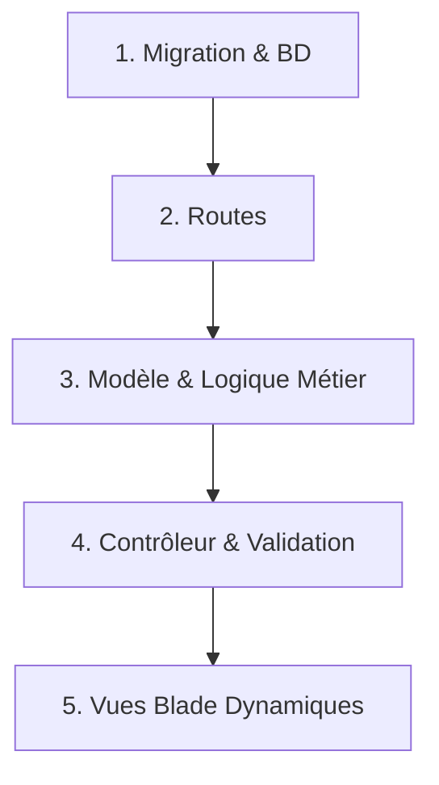

# 🗺️ Guide pas à pas : De l'interface statique au CRUD dynamique (AcademicYear)

Ce document décrit le cheminement étape par étape pour transformer un template statique HTML/Blade en un module CRUD fonctionnel connecté à la base de données. Nous prenons comme exemple l'entité **Année Académique** (`AcademicYear`).

---

## 🧭 Le flux général d'implémentation
L'implémentation suit toujours la séquence logique suivante :


---

## 🛠️ Étape 1 : Migration (Création de la Table)

On définit la structure de la table dans la base de données via une classe de migration Laravel. C'est l'étape fondatrice.

1.  **Génération du fichier :**
    ```bash
    php artisan make:migration create_academic_years_table
    ```
2.  **Définition des colonnes :** On y ajoute les types de champs requis, les valeurs par défaut et les contraintes d'unicité.
    *   **Fichier :** `database/migrations/2026_06_11_080625_create_academic_years_table.php`
    ```php
    Schema::create('academic_years', function (Blueprint $table) {
        $table->id();
        $table->string('libelle', 50)->unique(); // Règle : libellé unique (ex: "2025-2026")
        $table->date('date_debut');
        $table->date('date_fin');
        $table->boolean('est_active')->default(false); // Par défaut inactive
        $table->timestamps();
    });
    ```
3.  **Application :**
    ```bash
    php artisan migrate
    ```

---

## 🔌 Étape 2 : Routes (`routes/web.php`)

On déclare les points d'entrée (URLs) que l'application va exposer pour interagir avec ce module.

*   **Fichier :** `routes/web.php`
*   On utilise `Route::resource` pour déclarer automatiquement les 6 routes CRUD standards (index, create, store, edit, update, destroy), et on ajoute les routes spécifiques pour les actions personnalisées :
    ```php
    use App\Http\Controllers\Academic\AcademicYearController;

    Route::prefix('academic')->name('academic.')->group(function () {
        // Déclaration du CRUD standard (sans la vue show)
        Route::resource('academic-years', AcademicYearController::class)->except(['show']);

        // Actions spécifiques d'activation / désactivation (Méthode POST)
        Route::post('academic-years/{id}/activate',   [AcademicYearController::class, 'activate'])->name('academic-years.activate');
        Route::post('academic-years/{id}/deactivate', [AcademicYearController::class, 'deactivate'])->name('academic-years.deactivate');
    });
    ```

---

## 🧱 Étape 3 : Modèle Eloquent (`AcademicYear.php`)

Le modèle fait le pont entre la base de données et le code PHP. Il gère la sécurité des données entrantes (`$fillable`), le formatage des données (`$casts`) et les règles métiers.

*   **Fichier :** `app/Models/Academic/AcademicYear.php`
*   **Concepts clés appliqués :**
    1.  **Sécurité :** `$fillable` liste les colonnes modifiables via l'écriture de masse.
    2.  **Conversion :** `$casts` transforme automatiquement les chaînes SQL de dates en objets `Carbon` et le booléen SQL.
    3.  **Cycle de vie (Hooks) :**
        *   `creating` : Si une année est créée comme active, on passe toutes les autres à `false` via une requête directe.
        *   `updating` : Si une année existante est activée, on passe toutes les autres à `false` en excluant l'année courante (`id != $this->id`) pour éviter les conflits d'écriture et optimiser les performances (anti-N+1).
    ```php
    protected static function boot(): void
    {
        parent::boot();

        static::creating(function ($academicYear) {
            if ($academicYear->est_active) {
                static::where('est_active', true)->update(['est_active' => false]);
            }
        });

        static::updating(function ($academicYear) {
            if ($academicYear->est_active && $academicYear->isDirty('est_active')) {
                static::where('id', '!=', $academicYear->id)
                      ->where('est_active', true)
                      ->update(['est_active' => false]);
            }
        });
    }
    ```

---

## 🎛️ Étape 4 : Le Contrôleur (`AcademicYearController.php`)

Le contrôleur reçoit les requêtes HTTP, interroge le modèle, valide les données soumises et retourne la vue Blade appropriée.

*   **Fichier :** `app/Http/Controllers/Academic/AcademicYearController.php`
*   **Méthodes clés :**
    *   `index()` : Récupère les données paginées (`paginate(15)`) pour éviter les surcharges mémoires en cas de volume important.
    *   `store()` & `update()` : Valident les données entrantes avec des règles strictes (ex: `date_fin` supérieure à `date_debut` via `after:date_debut`).
    *   `activate()` & `deactivate()` : Modifient l'état d'activité d'une année et effectuent une redirection avec retour d'information (session flash).
    *   `destroy()` : Supprime l'enregistrement.

---

## 🔄 Étape 5 : Les Vues Blade Dynamiques

Dernière étape : on modifie les fichiers HTML pour y intégrer les directives Blade et rendre la page dynamique et sécurisée.

### A. Sécurisation et Directives de Formulaire
*   **Protection CSRF :** Obligatoire sur tous les formulaires modifiant l'état (POST, PATCH, DELETE) via la directive `@csrf`.
*   **Surcharge de méthode HTTP :** Les navigateurs ne supportant nativement que `GET` et `POST`, on simule `PATCH` ou `DELETE` grâce à la directive `@method(...)` :
    ```html
    <form action="{{ route('academic.academic-years.update', $academicYear->id) }}" method="POST">
        @csrf
        @method('PATCH')
    ```

### B. Routage Découplé (Helper `route`)
Au lieu de mettre des chemins d'accès en dur (ex: `/academic/academic-years/2/edit`), on utilise le helper de route nommée de Laravel :
```html
<a href="{{ route('academic.academic-years.edit', $year->id) }}">Modifier</a>
```
Cela permet de changer la structure d'URLs dans `web.php` à tout moment sans casser les liens de l'application.

### C. Maintien des anciennes saisies (`old`)
Pour éviter que l'utilisateur ne doive réécrire tout le formulaire en cas d'erreur de validation (ex: mot de passe trop court, date incorrecte), on utilise `old()` pour pré-remplir les champs :
```html
<x-form.input name="libelle" value="{{ old('libelle', $academicYear->libelle) }}" />
```

---

## 🌱 Étape 6 : Données de démonstration (Seeders)

Pour peupler le système avec des données initiales cohérentes et tester le fonctionnement du CRUD immédiatement :
*   **Fichier :** `database/seeders/AcademicYearSeeder.php`
*   **Stratégie ordonnée :**
    ```php
    // 1. On insère les années inactives
    AcademicYear::create(['libelle' => '2023-2024', 'est_active' => false]);
    // 2. On insère l'année active en DERNIER pour éviter de désactiver d'autres années lors du run
    AcademicYear::create(['libelle' => '2025-2026', 'est_active' => true]);
    ```

---

## 🔄 Focus : Fonctionnement du mécanisme d'activation/désactivation via `route()`

Voici comment s'effectue le cycle complet d'activation/désactivation d'une année :

### 1. La Route nommée (Routes)
Dans `routes/web.php`, on associe la route d'activation à un nom :
```php
Route::post('academic-years/{id}/activate', [AcademicYearController::class, 'activate'])
    ->name('academic-years.activate');
```
*Le nom complet résolu par le groupe est `academic.academic-years.activate`.*

### 2. Le Formulaire dans la vue (Vue Blade)
On utilise le helper `route()` pour générer dynamiquement l'URL avec l'identifiant de l'année. Les requêtes d'activation modifient l'état de la base de données, elles doivent donc obligatoirement être envoyées en **POST** (avec `@csrf`) pour des raisons de sécurité :
```html
<form action="{{ route('academic.academic-years.activate', $year->id) }}" method="POST" class="inline">
    @csrf
    <button type="submit">Activer</button>
</form>
```

### 3. La Réception par le Contrôleur (Contrôleur)
Le contrôleur intercepte la requête, recherche l'entité et appelle sa méthode métier :
```php
public function activate($id)
{
    $academicYear = AcademicYear::findOrFail($id);
    $academicYear->activate(); // Active cette année

    return redirect()->back()->with('success', "L'année {$academicYear->libelle} a été activée.");
}
```

### 4. L'automatisation dans le Modèle (Modèle Eloquent)
La méthode `$academicYear->activate()` déclenche une mise à jour (`$this->update(['est_active' => true])`). 
Le hook `updating` déclaré dans `AcademicYear::boot()` s'exécute automatiquement en base pour désactiver toutes les autres années actives, assurant ainsi la règle métier d'unicité :
```php
static::updating(function ($academicYear) {
    if ($academicYear->est_active && $academicYear->isDirty('est_active')) {
        static::where('id', '!=', $academicYear->id)
              ->where('est_active', true)
              ->update(['est_active' => false]);
    }
});
```
